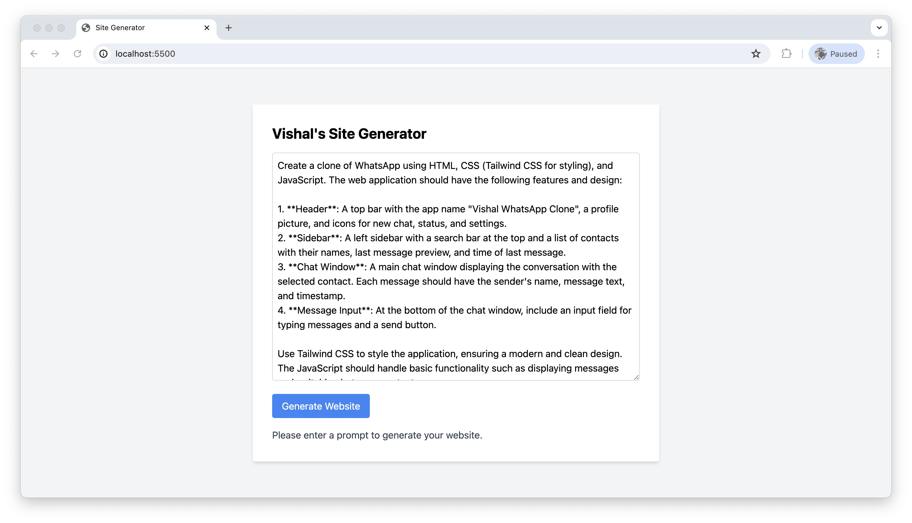
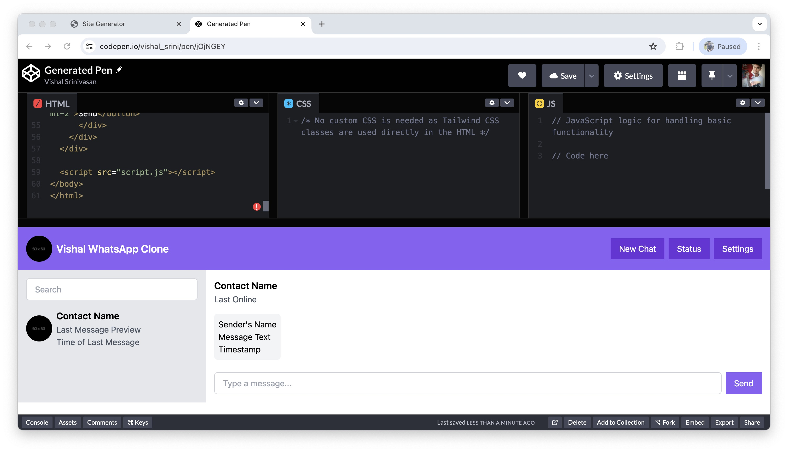

# Website Generator

This is a website generator application that generates a website based on user prompts using the GPT-3 language model by OpenAI. The generated website includes HTML, CSS, and JavaScript code. The application uses Express.js as the backend server, and the website is generated using Tailwind CSS.

## Features

- Generates a website based on user prompts
- Uses the GPT-3 language model by OpenAI to generate the website
- Generates HTML, CSS, and JavaScript code for the website
- Uses Tailwind CSS for styling the website

## Installation Instructions

1. Clone the repository: `git clone https://github.com/<username>/website-generator.git`
2. Navigate to the project directory: `cd website-generator`
3. Install the dependencies: `npm install`

## Usage Examples

1. Start the server: `npm start`
2. Open your browser and go to `http://localhost:3000`
3. Enter a prompt in the textarea provided and click on the "Generate Website" button.
4. The generated website code will be displayed.
5. Click on the "Create Pen" button to create a CodePen with the generated website code.

## Configuration Details

The backend server uses Express.js and listens on port 3000 by default. You can change the port in the `index.js` file.

The application uses Tailwind CSS for styling the website. The Tailwind CSS CDN is included in the `index.html` file.

The GPT-3 API is used to generate the website. You need to have a valid OpenAI API key to use the application. Set your API key in the `.env` file.

## Testing Instructions

The application does not have automated tests at the moment. You can manually test the application by following the usage examples mentioned above.

## Contributions Guidelines

Contributions to this project are welcome. Please follow the guidelines below:

1. Fork the project.
2. Create a new branch for your feature or bug fix.
3. Commit your changes with descriptive commit messages.
4. Push your code to your forked repository.
5. Submit a pull request to the main repository.

## Contact Information

For any questions or issues, please contact the developer:

- Name: Vishal Srinivasan
- Email: vishalvishal619@gmail.com

## Future Enhancements

- Add automated tests for the application
- Improve error handling and error messages
- Allow customization of the generated website's design and layout
- Add support for additional programming languages and frameworks
- Improve the user interface of the application